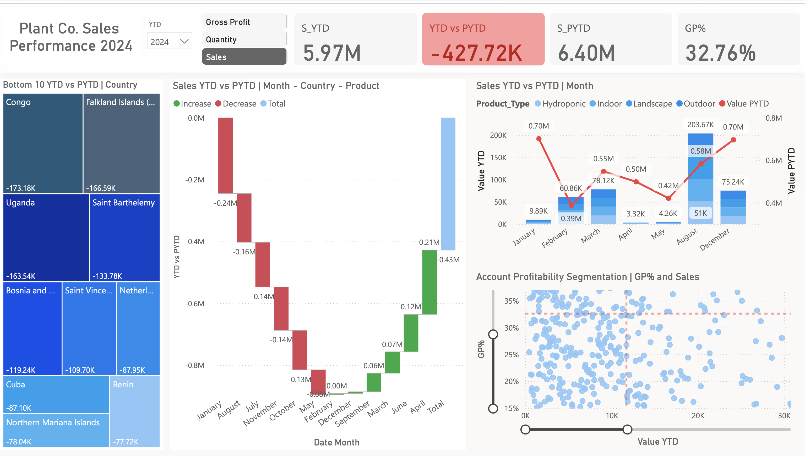

# Plant Sales Performance Dashboard

This Power BI project presents an interactive dashboard for analyzing the sales and profitability performance of a plant product company. The dashboard provides business-critical insights by comparing current Year-To-Date (YTD) results against the Previous Year-To-Date (PYTD), helping users quickly identify key trends and changes.

## 🖼️ Dashboard Snapshot

You can preview the final report layout below:

## 📊 Overview

The report is structured to support high-level performance tracking as well as granular analysis across time, geography, and product categories.

### Key Features

- **Sales and Profitability Summary**  
  Displays total sales (YTD), previous sales (PYTD), and gross profit percentage (GP%).

- **Monthly Sales Comparison**  
  Visualizes monthly YTD vs PYTD performance to highlight seasonal or cyclical sales trends.

- **Bottom 10 Countries by Performance Drop**  
  Identifies countries contributing the most to year-over-year sales declines.

- **Product Type Insights**  
  Compares sales performance across product types such as Hydroponic, Indoor, Landscape, and Outdoor.

- **Account Segmentation**  
  Plots GP% against sales volume to reveal account profitability patterns.

## 🧱 Data Model

The project follows a star schema design:
- **Fact Table**: `Fact_Sales`
- **Dimension Tables**: `Dim_Product`, `Dim_Country`, `Dim_Date`, and others
- Relationships enable flexible slicing and filtering across visuals.

## 📁 Repository Contents

- `Plant_Sales_Performance.pbix`: Power BI report file
- `dashboard_preview.png`: Snapshot of the final Power BI dashboard for preview

## 📄 License
This project is licensed under the Creative Commons BY-NC-ND 4.0 License. See the [LICENSE.md](LICENSE.md) file for more details.

---
This project demonstrates end-to-end Power BI skills, including data modeling, DAX calculations, data transformation using Power Query, and effective visual storytelling through dashboard design.
